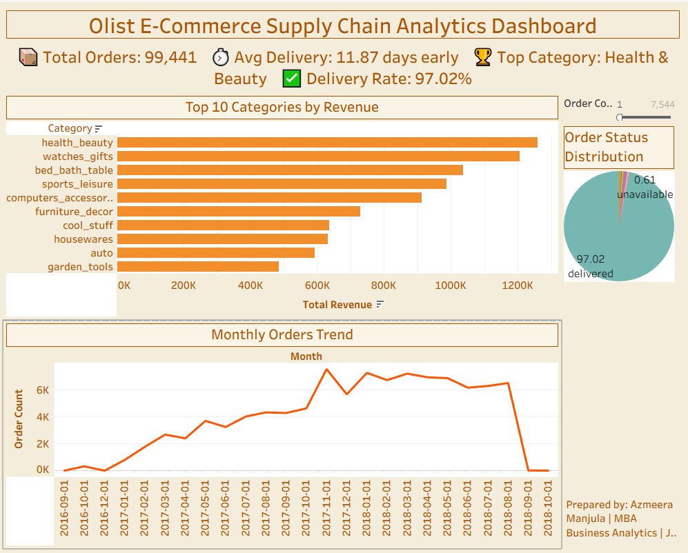

python -c "
import codecs
f = codecs.open('README.md', 'w', encoding='utf-8')
f.write(u'''# End-to-End E-Commerce Supply Chain ETL Pipeline \U0001f6d2

> A fully automated data pipeline processing 99,441 e-commerce orders using Python, SQL, PySpark, SQLite and Tableau.

---

## Key Findings \U0001f4ca

| KPI | Result |
|-----|--------|
| Total Orders | 99,441 |
| Delivery Success Rate | 97.02% |
| Average Delivery | 11.87 days EARLY |
| Top Category | Health and Beauty |
| Data Period | 25 months (2016-2018) |

---

## Pipeline Architecture \U0001f3d7

\`\`\`
Raw CSVs --> Python Ingest --> Clean and Transform --> SQLite DB --> Tableau Dashboard --> Automated Daily
\`\`\`

---

## Technology Stack \U0001f6e0

| Technology | Version | Purpose |
|-----------|---------|---------|
| Python | 3.11 | Core pipeline scripting |
| pandas | 3.0.3 | Data cleaning and transformation |
| PySpark | 3.5.1 | Large-scale data aggregation |
| SQL / SQLite | - | Database queries and KPI computation |
| sqlalchemy | - | Python-to-database connection |
| Tableau | 2026.1 | Interactive dashboard visualization |
| schedule | 1.2.2 | Automated daily pipeline execution |
| Git / GitHub | - | Version control and portfolio hosting |

---

## Dataset \U0001f4c1

| Property | Detail |
|----------|--------|
| Name | Brazilian E-Commerce Public Dataset by Olist |
| Source | https://www.kaggle.com/datasets/olistbr/brazilian-ecommerce |
| Volume | 100,000 orders across 9 CSV files (45 MB) |
| Period | September 2016 - October 2018 |
| Domain | E-Commerce / Supply Chain / Logistics |

### 9 Source Files

| File | Contents |
|------|----------|
| olist_orders_dataset.csv | Master orders - status, timestamps, delivery dates |
| olist_customers_dataset.csv | Customer city, state, unique ID |
| olist_order_items_dataset.csv | Product IDs, prices, freight values |
| olist_products_dataset.csv | Product details and category names |
| olist_sellers_dataset.csv | Seller location and ID |
| olist_order_payments_dataset.csv | Payment type and value |
| olist_order_reviews_dataset.csv | Customer satisfaction scores |
| olist_geolocation_dataset.csv | Zip codes mapped to coordinates |
| product_category_name_translation.csv | Portuguese to English categories |

---

## Folder Structure \U0001f4c2

\`\`\`
ecommerce-etl-pipeline/
|-- scripts/
|   |-- 02_transform.py
|   |-- 03_pyspark_transform.py
|   |-- 04_load.py
|   |-- 05_automate.py
|-- sql/
|   |-- 01_data_validation.sql
|-- data/processed/
|   |-- orders_clean.csv
|   |-- kpi_category_revenue.csv
|   |-- kpi_order_status.csv
|   |-- kpi_monthly_orders.csv
|-- docs/
|   |-- Workflow_Spec_Doc_Manjula.docx
|-- .gitignore
|-- README.md
\`\`\`

---

## How to Run

### 1. Clone the repository
\`\`\`bash
git clone https://github.com/AzmeeraManjula/ecommerce-etl-pipeline.git
cd ecommerce-etl-pipeline
\`\`\`

### 2. Install dependencies
\`\`\`bash
pip install pandas sqlalchemy pyspark schedule openpyxl
\`\`\`

### 3. Download dataset
Download from Kaggle and place all 9 CSV files in dataraw/archive/

### 4. Run pipeline step by step
\`\`\`bash
python scripts/02_transform.py
python scripts/03_pyspark_transform.py
python scripts/04_load.py
\`\`\`

### 5. Run automated pipeline
\`\`\`bash
python scripts/05_automate.py
\`\`\`
Runs pipeline once immediately, then daily at 8:00 AM

---

## Tableau Dashboard \U0001f4ca

| Chart | Type | Insight |
|-------|------|---------|
| Top 10 Categories by Revenue | Bar Chart | Health and Beauty leads at R$1.25M |
| Order Status Distribution | Pie Chart | 97.02% delivered successfully |
| Monthly Orders Trend | Line Chart | 30x growth over 25 months |

---

## Key Insights \U0001f50d

- Health and Beauty is #1 revenue category at R$1,258,681
- 97.02% of all orders delivered successfully
- Orders arrive 11.87 days early on average
- Order volume grew 30x from Sep 2016 to Sep 2018
- Only 0.63% of orders cancelled

---

## Pipeline Specification \U0001f5fa

Full workflow specification in docs/Workflow_Spec_Doc_Manjula.docx

Covers:
- Project objectives and scope
- Data source documentation
- Pipeline architecture (7 stages)
- KPI definitions and targets
- Technology stack justification
- 7-day project timeline

---

## Author

**Azmeera Manjula**
MBA - Business Analytics | ISBR Business School, Bengaluru
Email: manjulaazmeera2@gmail.com
GitHub: https://github.com/AzmeeraManjula

---

## License

This project uses the Olist Brazilian E-Commerce Dataset
available under CC BY-NC-SA 4.0 license.
''')
f.close()
print('Done!')
"