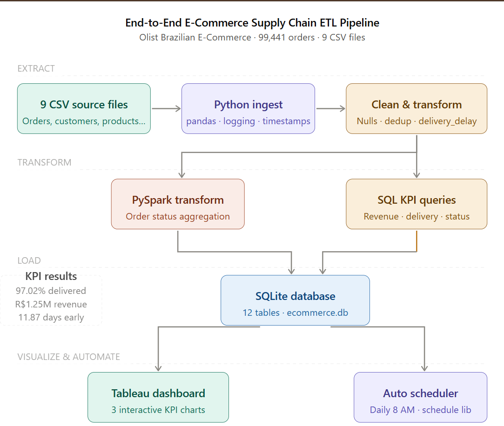
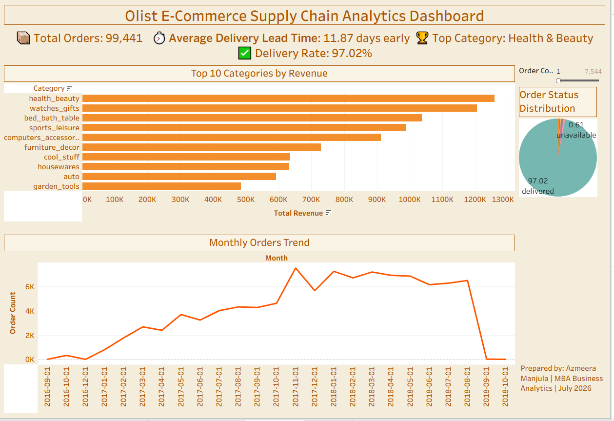

# End-to-End E-Commerce Supply Chain ETL Pipeline

> An end-to-end Data Engineering project that processes the Olist Brazilian E-Commerce dataset using Python, SQL, PySpark, SQLite, and Tableau to build an automated ETL pipeline and interactive analytics dashboard.

---

## Project Overview

This project demonstrates the complete lifecycle of a modern data pipeline.

Starting with raw CSV files, the pipeline performs automated ingestion, data cleaning, transformation, KPI generation, storage in SQLite, visualization in Tableau, and scheduled execution.

The project was built to showcase practical Data Engineering concepts including:

- ETL Pipeline Design
- Data Cleaning & Validation
- SQL Analytics
- PySpark Transformations
- Data Visualization
- Pipeline Automation
- Documentation & Version Control

---

# Pipeline Architecture

<p align="center">

</p>

---

# Tableau Dashboard

<p align="center">

</p>

---

# Key Business Metrics

| KPI | Value |
|------|--------|
| Total Orders Processed | **99,441** |
| Delivery Success Rate | **97.02%** |
| Average Delivery Performance | **11.87 Days Earlier Than Estimated** |
| Highest Revenue Category | **Health & Beauty (R$1,258,681)** |
| Dataset Period | **September 2016 – October 2018** |
| Source Files | **9 CSV Files** |

---

# Technology Stack

| Technology | Purpose |
|------------|---------|
| Python | ETL Pipeline Development |
| Pandas | Data Cleaning & Transformation |
| SQL | KPI Analysis |
| SQLite | Data Storage |
| SQLAlchemy | Database Connection |
| PySpark | Large-scale Data Aggregation |
| Tableau | Dashboard Development |
| Schedule Library | Pipeline Automation |
| Git & GitHub | Version Control |

---

# ETL Workflow

```
Raw CSV Files
        │
        ▼
Python Data Ingestion
        │
        ▼
Data Cleaning & Validation
        │
        ▼
PySpark Transformations
        │
        ▼
SQL KPI Analysis
        │
        ▼
SQLite Database
        │
        ├────────► Tableau Dashboard
        │
        └────────► Automated Scheduler
```

---

# Dataset Information

**Dataset**

Brazilian E-Commerce Public Dataset by Olist

**Source**

https://www.kaggle.com/datasets/olistbr/brazilian-ecommerce

**Dataset Summary**

- Approximately 100K Orders
- 9 CSV Files
- 45 MB Dataset
- Covers September 2016 – October 2018

### Source Files

| File | Description |
|------|-------------|
| olist_orders_dataset.csv | Order Information |
| olist_customers_dataset.csv | Customer Details |
| olist_order_items_dataset.csv | Ordered Products |
| olist_products_dataset.csv | Product Information |
| olist_sellers_dataset.csv | Seller Information |
| olist_order_payments_dataset.csv | Payment Records |
| olist_order_reviews_dataset.csv | Customer Reviews |
| olist_geolocation_dataset.csv | Geographic Data |
| product_category_name_translation.csv | Category Translation |

---

# Project Structure

```text
ecommerce-etl-pipeline/
│
├── data/
│   ├── raw/
│   ├── processed/
│   └── ecommerce.db
│
├── docs/
│
├── images/
│   ├── dashboard.png
│   └── pipeline_architecture.png
│
├── scripts/
│   ├── 01_ingest.py
│   ├── 02_transform.py
│   ├── 03_pyspark_transform.py
│   ├── 04_load.py
│   └── 05_automate.py
│
├── sql/
│   └── 01_data_validation.sql
│
├── README.md
└── .gitignore
```

---

# Project Features

- Automated ETL Pipeline
- Data Cleaning & Validation
- SQL KPI Generation
- PySpark Aggregations
- SQLite Data Warehouse
- Tableau Interactive Dashboard
- Automated Pipeline Scheduling
- Well-Documented Workflow

---

# Dashboard Insights

The Tableau dashboard provides insights into:

- Revenue by Product Category
- Monthly Order Trends
- Order Status Distribution
- Delivery Performance
- Business KPIs

---

# How to Run

## Clone Repository

```bash
git clone https://github.com/AzmeeraManjula/ecommerce-etl-pipeline.git

cd ecommerce-etl-pipeline
```

## Install Dependencies

```bash
pip install pandas sqlalchemy pyspark schedule openpyxl
```

## Execute Pipeline

```bash
python scripts/01_ingest.py

python scripts/02_transform.py

python scripts/03_pyspark_transform.py

python scripts/04_load.py
```

## Run Automated Scheduler

```bash
python scripts/05_automate.py
```

---

# Skills Demonstrated

- Data Engineering
- ETL Pipeline Development
- Data Cleaning
- SQL Query Optimization
- PySpark Processing
- Database Design
- Data Visualization
- Dashboard Development
- Pipeline Automation
- Git & GitHub Documentation

---

# Future Improvements

- PostgreSQL Integration
- Apache Airflow Workflow Orchestration
- Docker Containerization
- AWS Cloud Deployment
- Real-Time Data Streaming
- CI/CD Pipeline

---

# Author

**Azmeera Manjula**

MBA (Business Analytics)  
ISBR Business School, Bengaluru

GitHub: https://github.com/AzmeeraManjula

LinkedIn: *(Add your LinkedIn profile URL here)*

---

# License

This project uses the Olist Brazilian E-Commerce Public Dataset, which is distributed under the CC BY-NC-SA 4.0 License.